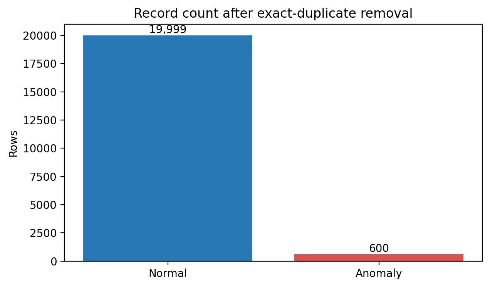
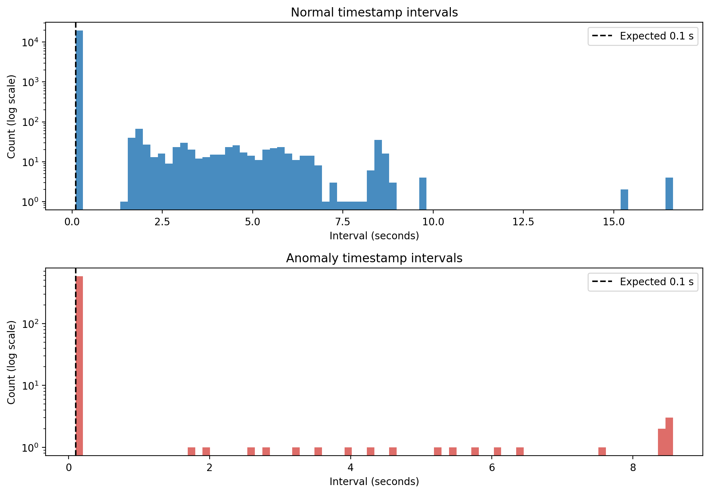
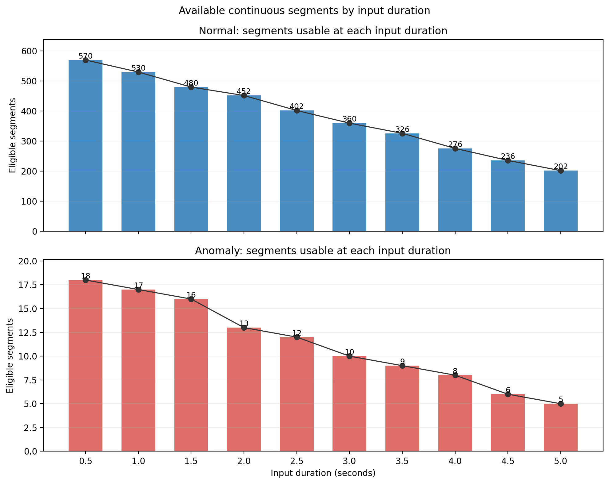
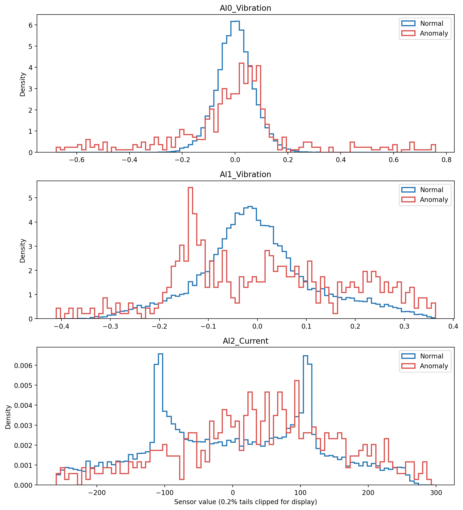
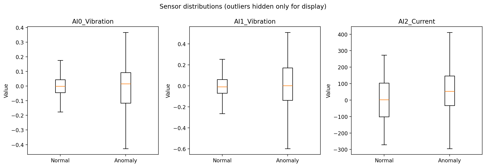
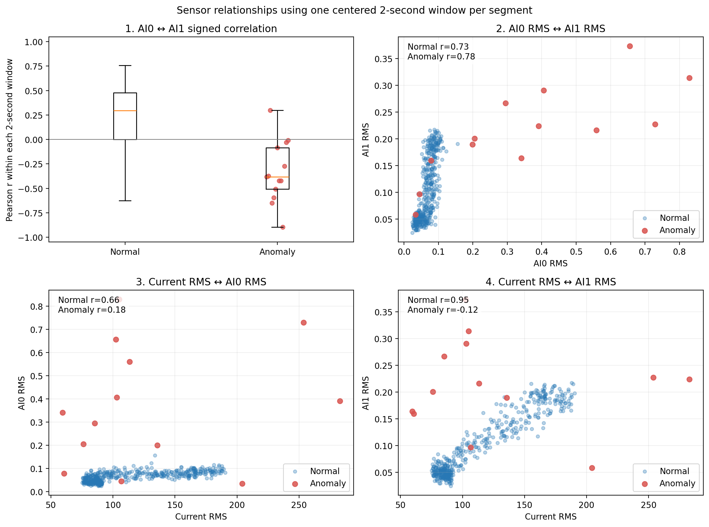
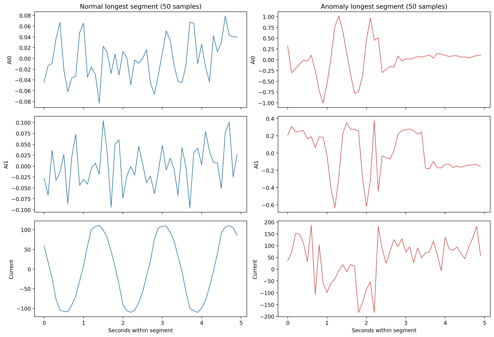

# 2.2 데이터 품질 확인

## 결론 요약

- 원본은 정상 20,000행, 이상 600행이다.
- 정상 파일에 완전히 동일한 행이 연속으로 2개 있으며, 이 중 추가 중복 1행을 제거해야 한다.
- 셀 단위 결측값, 파싱 실패 타임스탬프, 무한대 센서 값은 없다.
- 정확한 0.1초 연속성을 기준으로 정상 599개, 이상 21개 segment로 나뉜다.
- 정상은 2022-07-12, 이상은 2022-07-17에만 존재하므로 날짜와 라벨을 분리할 수 없다.
- 공백을 결측값으로 보간하지 않고 segment 경계로 처리해야 한다.

## 1. 데이터 구성

| 구분 | 원본 행 | 정제 후 행 | 시작 | 종료 | 라벨 |
|---|---:|---:|---|---|---:|
| 정상 | 20,000 | 19,999 | 2022-07-12 00:00:00.019000 | 2022-07-12 01:16:55.828000 | 0 |
| 이상 | 600 | 600 | 2022-07-17 10:51:07.943000 | 2022-07-17 10:53:53.540000 | 1 |

행 기준 정상:이상 비율은 약 33.3:1이다. 그러나 인접 행은 독립적인 사례가 아니므로 모델 평가에서는 행 개수보다 독립 segment 수를 기준으로 봐야 한다.

## 2. 중복·결측·유한값 검사

| 항목 | 정상 | 이상 | 처리 |
|---|---:|---:|---|
| 추가 완전 중복 행 | 1 | 0 | 모델링 전에 제거 |
| 중복 타임스탬프 추가 행 | 1 | 0 | 동일 행 제거 후 해소 |
| 결측·파싱 실패 | 0 | 0 | 추가 처리 불필요 |
| 무한대 센서 값 | 0 | 0 | 추가 처리 불필요 |

정상 중복은 동일한 타임스탬프와 세 센서 값, 라벨을 가진 동일 행 2개 중 하나가 추가로 들어간 경우다. `tables/duplicate_rows.csv`에 두 원본 행을 저장하였다.

## 3. 타임스탬프와 샘플 간격

| 구분 | 0.1초 간격 | 0.1초 초과 공백 | 역순·0 이하 | 최대 간격 | 연속 가정 시 추정 누락 |
|---|---:|---:|---:|---:|---:|
| 정상 | 19,400 | 598 | 0 | 16.643초 | 26,164 |
| 이상 | 579 | 20 | 0 | 8.572초 | 1,058 |

추정 누락 개수는 전체가 원래 연속 10 Hz 로그였다는 가정하의 계산이다. 모든 segment가 50시점 이하이므로 실제 누락이 아니라 최대 5초 단위로 의도적으로 추출한 데이터일 가능성도 있다. 원본 수집 방식을 확인하기 전에는 공백을 임의 보간하지 않는다.

## 4. 연속 segment

| 구분 | segment | 최소 시점 | 중앙값 | 최대 시점 | 0.5초 이상 | 1초 이상 | 1.5초 이상 | 2초 이상 |
|---|---:|---:|---:|---:|---:|---:|---:|---:|
| 정상 | 599 | 1 | 37.0 | 50 | 570 | 530 | 480 | 452 |
| 이상 | 21 | 3 | 28.0 | 50 | 18 | 17 | 16 | 13 |

위 그림은 정확히 해당 길이인 segment 수가 아니라, 각 입력 길이를 만들 수 있는 `최소 길이 이상`의 segment 수를 보여준다. 0.5초부터 5초까지 0.5초 단위로 모두 분리했으며 정상과 이상은 서로 다른 축에 표시하여 이상 막대가 정상에 가려지지 않게 했다.

| 입력 길이 | 사용 가능한 정상 segment | 사용 가능한 이상 segment |
|---:|---:|---:|
| 0.5초 | 570 | 18 |
| 1.0초 | 530 | 17 |
| 1.5초 | 480 | 16 |
| 2.0초 | 452 | 13 |
| 2.5초 | 402 | 12 |
| 3.0초 | 360 | 10 |
| 3.5초 | 326 | 9 |
| 4.0초 | 276 | 8 |
| 4.5초 | 236 | 6 |
| 5.0초 | 202 | 5 |

입력 길이가 늘수록 사용할 수 있는 데이터가 감소한다. 특히 이상은 0.5초 18개에서 3.5초 9개, 4초 8개, 5초 5개로 감소한다. 시계열 특징과 윈도우는 segment 경계를 넘어 계산하지 않으며, 같은 segment에서 나온 모든 중첩 윈도우는 Group CV에서 같은 fold에 둔다.

## 5. 센서 기본 분포

| 센서 | 정상 평균 ± 표준편차 | 정상 min~max | 이상 평균 ± 표준편차 | 이상 min~max |
|---|---:|---:|---:|---:|
| `AI0_Vibration` | -0.0001 ± 0.0706 | -0.3146 ~ 0.3517 | 0.0076 ± 0.4479 | -1.5027 ~ 1.8032 |
| `AI1_Vibration` | -0.0001 ± 0.1189 | -0.3665 ~ 0.3998 | -0.0081 ± 0.2412 | -0.7513 ~ 0.5093 |
| `AI2_Current` | 1.4419 ± 122.6661 | -271.5683 ~ 273.2350 | 57.3297 ± 153.1726 | -399.3512 ~ 538.8261 |

진동은 양수와 음수가 상쇄되므로 원시 평균만으로 크기를 판단하지 않는다. 이후 구간 분석에서는 RMS, 절댓값 peak, kurtosis, crest factor를 함께 확인한다. 전류도 양·음이 반복되므로 부하는 원시 평균보다 RMS 또는 envelope로 보는 것이 적절하다.

## 6. 센서 방향·에너지 관계

모든 관계는 20시점 이상인 각 segment의 중앙 2초를 한 번만 사용하여 계산하였다. 첫 번째 패널은 각 2초 구간 안에서 부호가 있는 AI0·AI1의 Pearson 상관 분포를 보여주며, 나머지 패널은 segment별 RMS 사이의 산점도와 정상·이상 Pearson 상관을 보여준다.

| 관계 | 정상 | 이상 | 확인 목적 |
|---|---:|---:|---|
| `AI0 ↔ AI1 signed correlation within window` | 0.295 | -0.382 | 상·하부 진동의 방향과 동조 |
| `AI0_RMS ↔ AI1_RMS` | 0.729 | 0.776 | 상·하부 진동 에너지 관계 |
| `Current_RMS ↔ AI0_RMS` | 0.662 | 0.179 | 부하 대비 상부 진동 |
| `Current_RMS ↔ AI1_RMS` | 0.949 | -0.124 | 부하 대비 하부 진동 |

첫 행은 segment별 상관계수의 중앙값이며, 나머지 세 행은 segment 사이의 Pearson 상관계수다. 정상에서는 Current RMS와 진동 RMS 관계가 강하지만 이상에서는 약해지는 경향이 나타난다. 이상은 13개 segment뿐이므로 이 차이는 추가 날짜 데이터에서 재검증해야 한다.

정확한 구간 특징과 요약값은 `tables/sensor_relationship_2s_features.csv`, `tables/sensor_relationship_summary.csv`에 저장하였다.

## 7. 대표 연속 구간

대표 그림은 각 클래스의 가장 긴 50시점 segment를 보여준다. 이는 데이터 품질과 파형 형태를 확인하기 위한 예시이며 전체 클래스의 대표성을 증명하지 않는다.

## 8. 모델링 전 확정 처리

1. 정상 파일의 추가 중복 1행을 제거한다.
2. 이름 없는 CSV 인덱스 열은 특징에서 제외한다.
3. 타임스탬프를 정렬하고 정확한 0.1초 연속 구간에 segment ID를 부여한다.
4. 시간 공백을 보간하지 않는다.
5. 윈도우와 시계열 파생변수는 segment 내부에서만 계산한다.
6. train/validation/test는 행이나 윈도우가 아니라 segment 단위로 분리한다.
7. 정상과 이상이 다른 날짜에만 존재한다는 제한을 모든 성능표에 명시한다.

## 9. 다음 단계

데이터 품질 처리가 확정되면 다음 단계에서는 정상·이상의 센서 분포, 구간 RMS, kurtosis, crest factor, 부하-진동 관계와 반복 프레스 사이클을 탐색한다.

## 생성 파일

- 표: `tables/`
- 이미지: `figures/`
- 재실행 코드: `scripts/analyze_data_quality.py`
