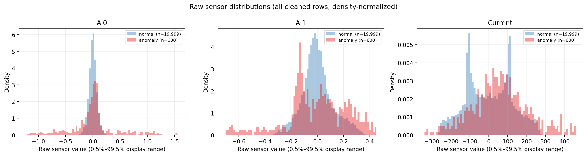
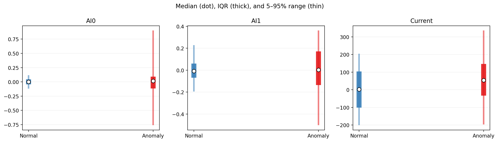
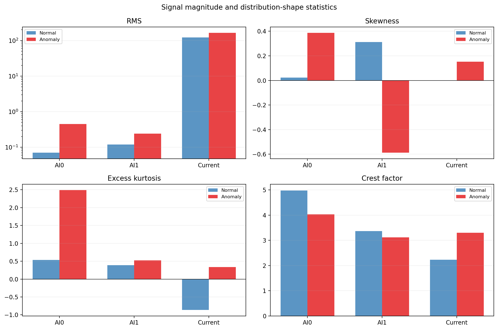
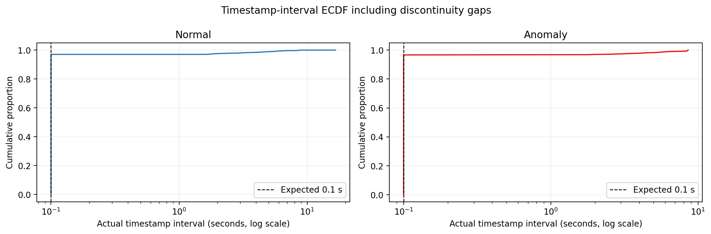
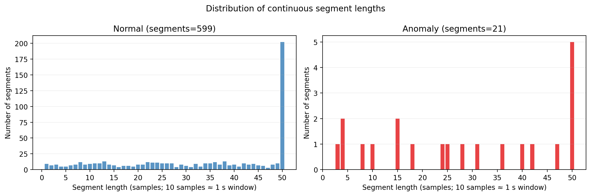
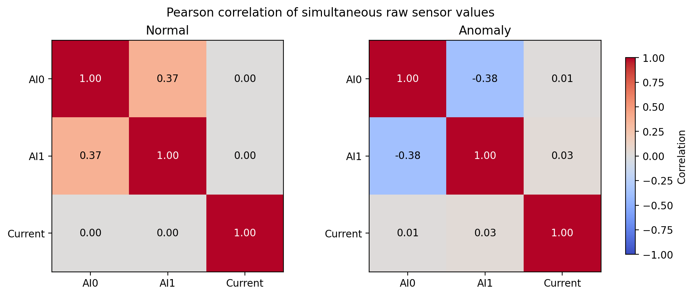
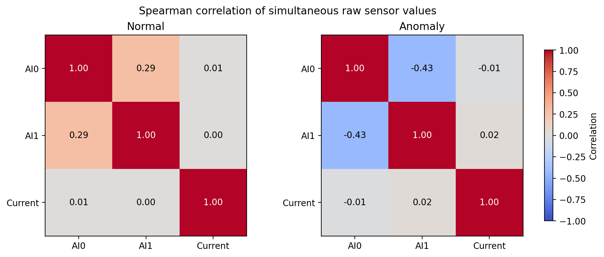
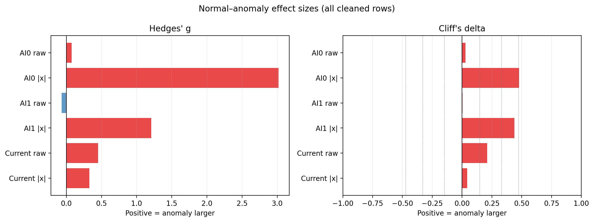

# 2.3 기초 통계

정상·이상 데이터의 규모, 분포, 시간 품질, 센서 관계와 효과크기를 한 번에 확인한다. 통계는 결측·정확히 중복된 행을 제거하고 타임스탬프를 정렬한 데이터로 계산했다. 정상은 19,999행, 이상은 600행이며 클래스 균형을 맞추기 위한 샘플링은 하지 않았다.

## 계산 기준

- 센서 기술통계와 상관계수는 정제된 모든 원시 행을 사용했다.
- RMS는 `sqrt(mean(x²))`, IQR은 `75% 분위수−25% 분위수`다.
- kurtosis는 정규분포가 0인 excess kurtosis다.
- crest factor는 `max(|x|)/RMS`다. 여기서는 클래스 전체 파형에 대한 탐색 통계이며, 모델 입력에서는 연속 segment 또는 window 안에서 다시 계산해야 한다.
- 실제 타임스탬프 간격 통계에는 0.1초 구간뿐 아니라 불연속 공백도 포함했다.
- 연속 segment는 인접 타임스탬프 간격이 정확히 0.1초인 행만 이어서 구성했다.
- 효과크기의 방향은 `이상−정상`이다. 양수이면 이상 값이 더 크고 음수이면 더 작다.

## 1. 데이터 개수와 센서 분포

히스토그램은 정상 19,999행과 이상 600행을 모두 사용하고, 클래스별 면적이 1이 되도록 density로 정규화했다. 따라서 막대 높이는 데이터 개수가 아니라 분포 모양을 비교한다. 극단값 때문에 중심부가 눌리지 않도록 그림만 각 클래스의 0.5~99.5% 범위를 표시했으며 CSV 통계에는 전체 최솟값과 최댓값이 포함된다.

## 2. 평균·표준편차·중앙값·IQR·분위수·범위

| 구분 | 센서 | 개수 | 평균 ± 표준편차 | 중앙값 [IQR] | 최솟값–최댓값 | 5% / 25% / 75% / 95% |
|---|---|---:|---:|---:|---:|---:|
| normal | AI0 | 19,999 | -0.0001 ± 0.0706 | -0.0002 [0.0882] | -0.3146–0.3517 | -0.1176 / -0.0442 / 0.0440 / 0.1170 |
| normal | AI1 | 19,999 | -0.0001 ± 0.1189 | -0.0093 [0.1294] | -0.3665–0.3998 | -0.1942 / -0.0693 / 0.0602 / 0.2281 |
| normal | Current | 19,999 | 1.442 ± 122.67 | 1.848 [205.16] | -271.57–273.24 | -201.01 / -101.31 / 103.85 / 203.87 |
| anomaly | AI0 | 600 | 0.0076 ± 0.4479 | 0.0158 [0.2093] | -1.503–1.803 | -0.7600 / -0.1164 / 0.0929 / 0.9013 |
| anomaly | AI1 | 600 | -0.0081 ± 0.2412 | 0.0022 [0.3079] | -0.7513–0.5093 | -0.5018 / -0.1364 / 0.1714 / 0.3616 |
| anomaly | Current | 600 | 57.330 ± 153.17 | 53.644 [180.01] | -399.35–538.83 | -196.75 / -33.379 / 146.63 / 336.29 |

전체 정밀값은 `tables/sensor_descriptive_statistics.csv`에 저장했다.

## 3. RMS·왜도·kurtosis·crest factor

| 구분 | 센서 | RMS | 왜도 | Excess kurtosis | Crest factor |
|---|---|---:|---:|---:|---:|
| normal | AI0 | 0.0706 | 0.0224 | 0.5340 | 4.979 |
| normal | AI1 | 0.1189 | 0.3129 | 0.3910 | 3.363 |
| normal | Current | 122.67 | -0.0018 | -0.8628 | 2.227 |
| anomaly | AI0 | 0.4476 | 0.3864 | 2.489 | 4.028 |
| anomaly | AI1 | 0.2412 | -0.5871 | 0.5253 | 3.115 |
| anomaly | Current | 163.43 | 0.1517 | 0.3384 | 3.297 |

RMS는 전체적인 신호 크기, 왜도는 좌우 비대칭, kurtosis는 꼬리와 극단값의 강도, crest factor는 RMS 대비 최대 peak의 크기를 나타낸다. 전체 클래스 단위 crest factor는 데이터 길이에 영향을 받으므로 정상·이상 비교를 확정하는 지표로 단독 사용하지 않는다.

## 4. 실제 타임스탬프 간격

| 구분 | 간격 수 | 평균 ± 표준편차(초) | 최솟값 | 중앙값 | 최댓값 | 0.1초 | 0.1초 초과 공백 |
|---|---:|---:|---:|---:|---:|---:|---:|
| normal | 19,998 | 0.2308 ± 0.8569 | 0.1000 | 0.1000 | 16.643 | 19,400 | 598 |
| anomaly | 599 | 0.2765 ± 1.039 | 0.1000 | 0.1000 | 8.572 | 579 | 20 |

평균과 표준편차에는 긴 수집 공백이 포함되므로 0.1초 샘플링 주기의 안정성을 나타내는 값이 아니다. 실제 연속 여부는 0.1초 간격 수와 공백 수로 판단해야 한다.

## 5. 연속 segment 개수와 길이 분포

| 구분 | segment 수 | 평균 ± 표준편차(시점) | 최소 | 5% | 25% | 중앙값 | 75% | 95% | 최대 |
|---|---:|---:|---:|---:|---:|---:|---:|---:|---:|
| normal | 599 | 33.387 ± 16.385 | 1.000 | 5.000 | 20.000 | 37.000 | 50.000 | 50.000 | 50.000 |
| anomaly | 21 | 28.571 ± 17.537 | 3.000 | 4.000 | 15.000 | 28.000 | 47.000 | 50.000 | 50.000 |

한 시점은 0.1초 간격이다. 예를 들어 20시점은 모델 입력 길이로 약 2초이며, 첫 타임스탬프와 마지막 타임스탬프 사이의 span은 1.9초다. 모든 segment의 길이는 `tables/segment_lengths.csv`에 저장했다.

## 6. 센서 간 Pearson·Spearman 상관계수

Pearson은 동시 센서값의 선형 관계, Spearman은 값의 순위가 함께 증가하거나 감소하는 단조 관계를 본다. 이 그림은 모든 원시 행을 한꺼번에 계산한 탐색 결과다. 프레스 사이클이나 시간 지연 관계를 의미하지 않으며, 불연속 segment를 이어 붙여 시차 상관을 계산한 것도 아니다.

## 7. 정상·이상 간 효과크기

| 센서 | 표현 | Hedges' g | Cliff's delta | 정상 중앙값 | 이상 중앙값 |
|---|---|---:|---:|---:|---:|
| AI0 | 원신호 | 0.0742 | 0.0297 | -0.0002 | 0.0158 |
| AI0 | 절댓값(abs) | 3.017 | 0.4778 | 0.0441 | 0.1009 |
| AI1 | 원신호 | -0.0648 | 0.0032 | -0.0093 | 0.0022 |
| AI1 | 절댓값(abs) | 1.209 | 0.4383 | 0.0652 | 0.1421 |
| Current | 원신호 | 0.4519 | 0.2108 | 1.848 | 53.644 |
| Current | 절댓값(abs) | 0.3271 | 0.0444 | 102.66 | 99.540 |

Hedges' g는 평균 차이를 합동 표준편차 단위로 나타내며, 일반적으로 절댓값 0.2/0.5/0.8을 작은/중간/큰 차이의 참고선으로 본다. Cliff's delta는 임의의 이상 값이 정상 값보다 클 확률에서 작을 확률을 뺀 비모수 효과크기이며, -1~1 범위다. 진동 원신호는 양·음이 상쇄될 수 있으므로 `|x|` 효과도 함께 제시했다.

## 해석 시 제한

- 정상과 이상은 서로 다른 날짜에 측정되어 날짜·운전조건 효과와 고장 효과가 섞일 수 있다.
- 행 단위 표본은 시간적으로 독립이 아니므로 행 수가 많다고 독립 실험 수가 많은 것은 아니다.
- 정상 19,999행과 이상 600행으로 불균형하며, 특히 효과크기의 불확실성은 segment 단위 bootstrap 등으로 추가 확인해야 한다.
- 이 단계는 탐색 통계다. 모델 검증에서는 반드시 segment 단위 분리를 사용한다.
